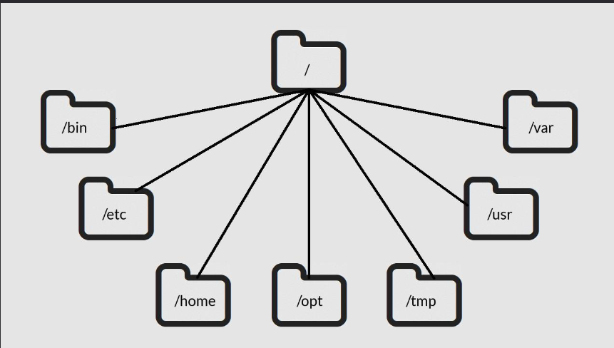
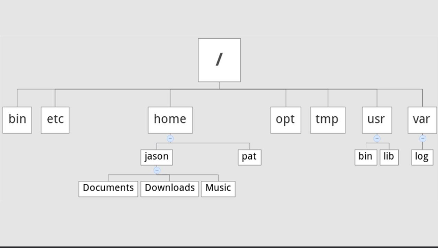

Background and Introduction

- Linux can refer to the operating system
- Can refer to Linux Kernel

A distribution is the Linux Kernel plus additional software.

**Linux Kernel** is the heart of the Linux OS.

## Directory Structure

### Common Directories

- `/` Root, the top of the file system hierarchy
- `/bin` Binaries and other executable programs
- `/etc` System configuration file, e.g. there is a config file in /etc that tells the OS whether to boot in text mode or graphical mode
- `/home` Home directory, is where users data is stored. Users have different home directories, for example home directory for a user named john is /home/john. There is an exception for the root user where its home directory is /root.
- `/opt` Optional or third party software, for example google chrome, or avg anti-virus will become /opt/google/chrome and /opt/avg respectively.
- `/tmp` Temporary space, typically cleared on reboot
- `/usr` User related programs, just like home directory, e.g. you can have `/usr/john` directory that can have bin files for example like /usr/john/bin
- `/var` Variable data, things that change often, like log files





### Comprehensive Listing

> You can find a comprehensive listing of directories in this file: [](./Linux-Directory-Structure.pdf)

These are some interesting directories:

- `/boot` Files needed to boot the system. This is where Linux kernel is stored as well as the initial RAM disk (initrd).

  > The initrd is a temporary file system that is loaded during boot. It contains device drivers and other files needed to access the root file system.

- `/dev` Device files, e.g. /dev/null, /dev/sda1. These are special files that represent devices. For example /dev/null is a special file that discards all data written to it. /dev/sda1 is a special file that represents the first partition on the first hard disk.
- `/media` Where removable media is mounted, e.g. USB drives, CD-ROMs, etc. When you insert a USB drive, it will be mounted in `/media/username/usb-drive-name` so that you can access data on it.
- `/srv` Service data, e.g. FTP and HTTP servers might store their data here. For example, a web server might store its data in `/srv/www`.
- `/usr` Secondary hierarchy for read-only user data. This is where most of the programs are installed. For example, you will find binaries in `/usr/bin`, libraries in `/usr/lib`, and documentation in `/usr/share/doc`.

### Application Directory Structure

User applications that are not bundled with the Linux distro are typically installed in `/opt` or `/usr/local`. For example, the crashplan app might install itself in `/usr/local/crashplan` and have directories like `/usr/local/crashplan/bin` and `/usr/local/crashplan/lib`. This is just an example and might change depending on the app.

Applications can also be installed in `/opt`. For example, avg antivirus might install itself in `/opt/avg` and have directories like `/opt/avg/bin` and `/opt/avg/var`.

Another common pattern is to have `/opt/appname/bin`, `/opt/appname/lib`, `/etc/opt/appname`, and `/var/opt/appname` folders for an application.

## The Shell

The shell is the default interface to the Linux system. A shell can refer to the CLI or GUI, but usually refers to the CLI.

### Shell Prompt

When shell is started it displays a prompt, which can be something like `[waleed@linuxserver ~]$`. The `$` sign you are running as a normal user as opposed to `#` sign which means you are running as root.

Prompt signs:

- `$` Normal user - e.g. when you login as a normal user
- `#` Root user - e.g. when you use `sudo` command
<!-- - `%` Super user - e.g. when you use `su` command to switch to another user -->
- `~` Home directory - e.g. when you use `cd` command without any arguments

Tilde expansion:

You can use `~` to refer to the home directory, for example `~root` = `/root`, `~waleed` = `/home/waleed`, and so on. Note that `~` refers to home directory which might not live inside the `/home` directory, just as root user's home directory is `/root` and not `/home/root`. Read more about [tilde expansion](https://www.gnu.org/software/bash/manual/html_node/Tilde-Expansion.html).

### Path environment variable

The path environment variable is a list of directories that the shell searches for executable files. For example, when you type `ls` in the shell, the shell will search for `ls` in the directories listed in the path environment variable. If it finds it, it will execute it, otherwise it will display an error message.

This is an example of the path environment variable:

```bash
echo $PATH
/usr/local/bin:/usr/bin:/usr/local/sbin:/usr/sbin:/home/waleed/.local/bin:/home/waleed/bin
```

Directories are separated by a colon `:`. So when you type `ls`, the shell will search for `ls` in `/usr/local/bin`, `/usr/bin`, `/usr/local/sbin`, `/usr/sbin`, `/home/waleed/.local/bin`, and `/home/waleed/bin` in that order.

To pretty print the path environment variable, you can use the following command:

```bash
echo $PATH | tr ':' '\n'
```

### Man command

Use `man -k SEARCH_TERM` to search for a command. For example, `man -k "list files"` will search for commands that list files.

## Directories

### Directory shortcuts

- `.` refers to the current directory
- `..` refers to the parent directory
- `-` refers to the previous directory, for example `cd -` takes you to the previous directory you were in. The `$OLDPWD` environment variable holds the previous directory.

### Creating directories

- `mkdir -p` creates parent directories if they don't exist, e.g. `mkdir -p /dir1/dir2/dir3/dir4` will create dir1, dir2, dir3, and dir4 if they don't exist.
